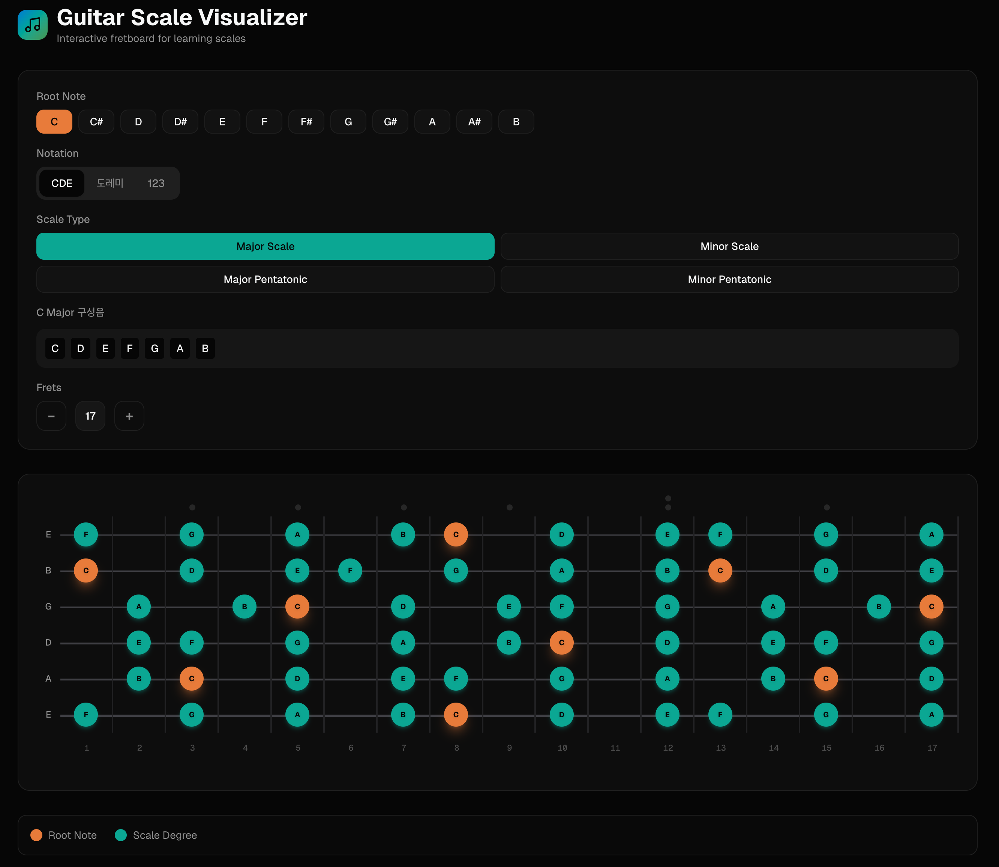

# 기타 스케일 시각화



## 소개

기타 스케일 학습을 위한 인터랙티브 웹 애플리케이션입니다. 다양한 스케일을 프렛보드 위에 시각화하여 직관적으로 학습할 수 있습니다.

## 주요 기능

### 🎸 프렛보드 시각화
- 실제 기타 프렛보드와 동일한 레이아웃으로 스케일 표시
- 5~22개 프렛까지 조절 가능
- 반응형 디자인으로 모바일 환경에서도 최적화

### 🎵 현재 지원하는 스케일
- **메이저 스케일** (Major Scale)
- **마이너 스케일** (Minor Scale)
- **메이저 펜타토닉** (Major Pentatonic)
- **마이너 펜타토닉** (Minor Pentatonic)

### 🎼 표기법
- **알파벳 표기** (C, D, E, F, G, A, B)
- **계이름 표기** (도, 레, 미, 파, 솔, 라, 시)
- **인터벌 표기** (1, 2, 3, 4, 5, 6, 7)

### 🎹 루트 노트 선택
- 12개 음계 모두 선택 가능 (C, C♯/D♭, D, D♯/E♭, E, F, F♯/G♭, G, G♯/A♭, A, A♯/B♭, B)
- 선택한 표기법에 따라 자동으로 표시 전환

## 기술 스택

- **프레임워크**: Next.js 16 (React 19)
- **스타일링**: Tailwind CSS 4
- **UI 컴포넌트**: Radix UI
- **애니메이션**: Framer Motion
- **타입 안전성**: TypeScript
- **오디오**: Tone.js (소리 재생 기능)

## 시작하기

### 설치

```bash
# 의존성 설치
pnpm install
```

### 개발 서버 실행

```bash
pnpm dev
```

브라우저에서 [http://localhost:3000](http://localhost:3000)을 열어 확인할 수 있습니다.

### 빌드

```bash
pnpm build
```

### 프로덕션 서버 실행

```bash
pnpm start
```

## 프로젝트 구조

```
├── app/                    # Next.js App Router
│   ├── page.tsx           # 메인 페이지
│   ├── layout.tsx         # 루트 레이아웃
│   └── globals.css        # 글로벌 스타일
├── components/            # React 컴포넌트
│   ├── fretboard.tsx      # 프렛보드 컴포넌트
│   ├── root-note-selector.tsx
│   ├── scale-selector.tsx
│   ├── notation-toggle.tsx
│   └── ui/                # UI 기본 컴포넌트
├── lib/                   # 유틸리티 함수
│   └── music-utils.ts     # 음악 이론 관련 함수
└── public/                # 정적 파일
```

## 사용 방법

1. **루트 노트 선택**: 원하는 음계의 시작 음을 선택합니다.
2. **스케일 타입 선택**: 학습하고 싶은 스케일 종류를 선택합니다.
3. **표기법 선택**: 편한 표기법으로 전환합니다.
4. **프렛 수 조절**: 기타에 맞게 프렛 수를 조절합니다.
5. **프렛보드 확인**: 강조된 음들을 통해 스케일 패턴을 학습합니다.