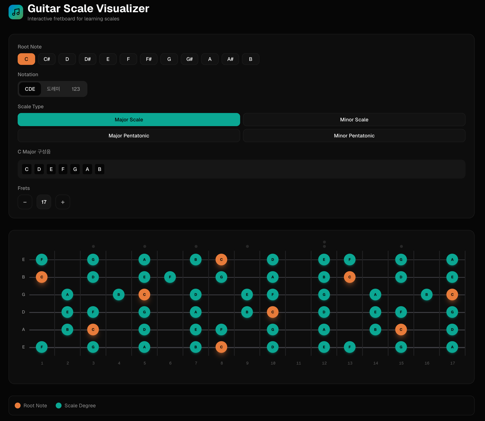

# Guitar ScaleUp



## 소개

"기타 연습을 더 쉽고 정확하게" — 기타 연습에 필요한 도구를 한 곳에 모은 인터랙티브 웹 애플리케이션입니다.

## 주요 기능

### 🎸 스케일 연습 (`/guitar-scale`)

- 6현 프렛보드 위에 스케일을 시각화 (5~24개 프렛까지 조절 가능)
- 메이저·마이너·펜타토닉·도리안·믹소리디안·리디안·프리지안·하모닉 마이너·멜로딕 마이너까지 10종 스케일
- CAGED 시스템 셰이프(C·A·G·E·D)별 지판 구간 하이라이트
- 실시간 사운드 재생 (Tone.js)
- 반응형 디자인으로 모바일 환경에서도 최적화

### 📖 코드사전 (`/chords`)

- 코드 구성음과 운지법을 다이어그램으로 표시
- 코드 사운드 재생

### ⏱️ 메트로놈 (`/metronome`)

- BPM·박자·세분화 조절, 탭 템포
- 사운드 6종 지원

### 🎯 튜너 (`/tuner`)

- 마이크로 실시간 피치를 감지해 편차(낮음/높음/정확) 표시
- 6-인라인 헤드스톡 GUI에서 줄(1~6번) 선택 방식 — EADGBE를 몰라도 튜닝 가능
- 8종 튜닝 프리셋 지원

### 🎼 공통 표기법

- **알파벳 표기** (C, D, E, F, G, A, B)
- **계이름 표기** (도, 레, 미, 파, 솔, 라, 시)
- **인터벌 표기** (1, 2, 3, 4, 5, 6, 7)
- 12개 음계 모두 선택 가능하며, 선택한 표기법에 따라 자동으로 표시 전환

## 기술 스택

- **프레임워크**: Next.js 16 (App Router) · React 19
- **스타일링**: Tailwind CSS 4
- **UI 컴포넌트**: Radix UI
- **애니메이션**: Framer Motion
- **타입 안전성**: TypeScript
- **오디오/피치 검출**: Tone.js, Web Audio API

## 시작하기

### 설치

```bash
# 의존성 설치
pnpm install
```

### 개발 서버 실행

```bash
pnpm dev
```

브라우저에서 [http://localhost:3000](http://localhost:3000)을 열어 확인할 수 있습니다.

### 빌드

```bash
pnpm build
```

### 프로덕션 서버 실행

```bash
pnpm start
```

### 테스트

```bash
pnpm test
```

## 문서

- [`CLAUDE.md`](CLAUDE.md) — 음악 이론 로직·스케일 카탈로그·테스트 요구사항 (authoritative)
- [`DESIGN.md`](DESIGN.md) — 디자인 시스템 (authoritative)
- [`PLAN.md`](PLAN.md) — 로드맵
- [`docs/caged-system-spec.md`](docs/caged-system-spec.md) — CAGED 시스템 아키텍처 스펙

## 크레딧

- 기타 사운드 샘플: [tonejs-instruments](https://github.com/nbrosowsky/tonejs-instruments) (guitar-electric, guitar-acoustic) — 샘플 라이선스 [CC-BY 3.0](https://creativecommons.org/licenses/by/3.0/), © N. Brosowsky 및 원 샘플 제작자들. `public/samples/`에 mp3 일부를 포함.
